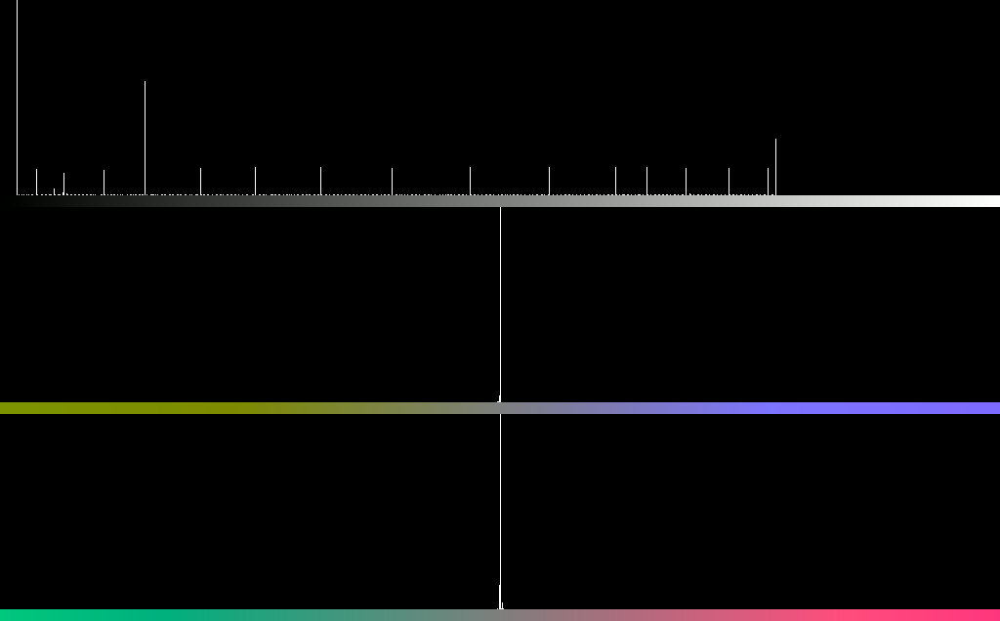

# KMShot
KMShot is an experimental screenshot tool for Linux, written in C++. It reads from the DRM subsystem similar to how [Sunshine](https://github.com/LizardByte/Sunshine)'s `kmsgrab` capture works.
This tool can be used to capture wide color gamut screenshots or HDR content in higher-than-8-bit color depths, tested on KDE Plasma Wayland session and an AMD GPU.

### Building
KMShot uses CMake as its build system. To build the project, headers for DRM, GBM, EGL, GLES2, and LittleCMS 2 need to be installed. You can build it using the following commands:
```bash
cmake -S . -B build
cmake --build build
```
This will generate the executable in the `build` directory.

### Usage
To use this tool, the executable will need to either have `cap_sys_admin` or run as root.
Example usage (assuming `slurp` and `avifenc` are installed and in PATH):
SDR 10bpc YUV444 capture into AVIF (needs caution, see "Important Notes on Color Accuracy" below):
```bash
slurp |\
sudo ./kms_capture --card /dev/dri/card0 --frames 1 \
--stdout --pp-y4m --slurp --slurp-scale <display scaling> | \
avifenc -q 100 --stdin output_sdr.avif --depth 10 --yuv 444 --cicp 9/13/9 --range full
```

HDR capture (needs HDR to be enabled in the display settings, and the tool only works when DRM reports BT.2020):
```bash
slurp | \
sudo ./kms_capture --card /dev/dri/card0 --frames 1 \
--max-nits <max-nits> --stdout --pp-y4m --slurp --slurp-scale <display scaling> | \
avifenc -q 100 --stdin output_hdr.avif --depth 10 --yuv 444 --cicp 9/16/9 --clli <MaxCLL,MaxFALL> --range full
```
Being a screenshot tool, the captured frame would likely not be a well behaved, singular HDR image and instead might contain a mix of SDR (e.g. UI) and HDR content. In this case, it's currently recommended to set the MaxCLL/MaxFALL values according to the monitor's capabilities, so that the screenshot would look similar to the source content, when viewed on a 10000-nit reference display (or displays that have better capabilities than the monitor used for capture). However, this needs further testing, and no testing has been done on setting the values other than the monitor's capabilities.

Experimental 12bpc capture of linear RGB data into an 16bpc PNG (requires `ffmpeg`, and this WILL look wrong perceptually):
```bash
sudo ./kms_capture --card /dev/dri/card0 --frames 1 --sdr-linear-12bpc --stdout | \
ffmpeg -f rawvideo -video_size <width>x<height> -pix_fmt rgba64le -i - \
 -c:v png -pix_fmt rgba64be ./output.png -y
 ```

[slurp](https://github.com/emersion/slurp) can be used to select the capture area, and without `--slurp` this tool will capture the entire framebuffer. Since `slurp` outputs logical coordinates, the `--slurp-scale` option is used to scale the coordinates to the actual framebuffer size. This needs to match the scaling of the current workspace (display scaling on single-monitor systems).

### Important Notes on Color Accuracy
**TL;DR: Color accuracy is bad in SDR mode, but HDR should be fine**

KDE Plasma blends to the monitor's native profile primaries when DRM reports Colorspace = 0 (Default), but uses (likely) a pure gamma 2.2 transfer function. It's hard to map these colors back into well defined color spaces since profiles might contain non-linear LUTs that are not easily invertible. Currently, the tool hardcodes the monitor's primaries to convert pixel values into BT.709 or BT.2020 with sRGB transfer. This needs either LittleCMS with the monitor's primaries or a manually calculated 3x3 transfer matrix from the monitor's color space to Rec.709/Rec.2020  (see `color_transform.cpp`). In testing with KDE Plasma set to "prefer color accuracy" (16bpc max) using grayscale and RGB ramps from 0 to 1023, up to 10% error was observed in the green channel on a calibrated NE160QDM-NM7 monitor panel, in "prefer efficiency" accuracy is better but still not pixel-perfect. In HDR mode, where KDE agreed on using BT.2020 and PQ, color accuracy is better since the colorspace is much more well defined, and less transformation needs to be done on the pixel values.

### Examples and sanity checks
Example of a synthetic luminance block pattern, its screenshot on a 1261-nit monitor, and the screenshot histogram:
|Synthetic pattern|Monitor screenshot|
|:---------------:|:----------------:|
|||

Histogram:


The synthetic image is tagged with MaxCLL/MaxFALL of 10,000/1125 nits. The screenshot is tagged with MaxCLL/MaxFALL of 1261/604 nits (the EDID MaxCLL and preferred MaxFALL values of the source monitor), so that on HDR displays that have better capabilities, the screenshot should look the same as when it was taken, but won't be the same as the original image viewed on another monitor. On SDR displays and HDR displays that report lower peak luminance levels, the scrennshot should look similar to the original image.
To verify if the tool works properly on a given system, it's possible to take a screenshot of an arbitrary HDR image (e.g., this test pattern) and compare the screenshot side by side with the original image on a viewer that supported HDR (like Chromium), and they should look the same.

### Notes
###### (and also personal thoughts and rants)
- This tool is written with extensive use of LLMs, so expect some weird code here and there. 
- It seems either I'm making mistakes, or that Gwenview is not very well color managed at this point. I'm treating the display results on Chromium as HDR ground truths since it seems to be  more accurate (though it also introduces its own color shifts in SDR).
- VRAM framebuffers are usually not directly in a decodable format, and this tool used DMA-BUF to map the images into a GL context and read the pixels back. The implementation is not very optimized and can incur significant CPU overhead compared to the Sunshine kmsgrab implementation.
- I have little knowledge about color science,  if you see any mistakes or have suggestions on improving the project, please let me know!
- However, this is a project coming out of a sudden burst of curiosity, and it might not be maintained in the long run (also see my other abandoned projects). Hopefully, soon we will have proper protocols and APIs for such functionalities in Wayland.
- Technically, this tool is built with support for streaming frames in mind, but frame synchronization is not implemented and the current implementation is too CPU-heavy for real-time capture, so it's discouraged to run it with `--frames` set to more than 1 for now. The tool also doesn't support capturing from multiple planes, so OSDs and cursors that are rendered on separate planes won't be captured.
